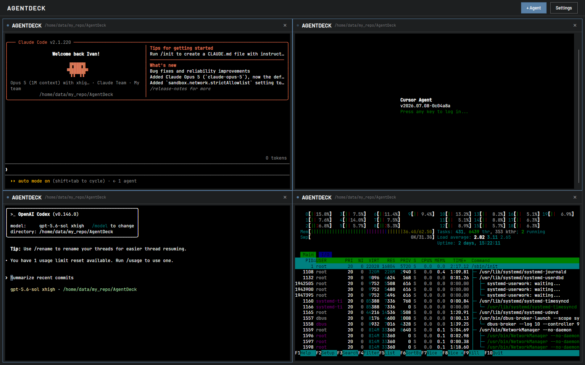

# AgentDeck

A desktop cockpit for console LLM agents. One window holds a deck of up to eight
real terminals, so `claude`, `codex`, `cursor-agent` and a plain shell all run
side by side instead of scattered across tabs you keep losing.

Every pane is a full terminal: point it at a folder, pick a tool, and it starts.
Drag panes by the header to rearrange or split them, pull the edges to resize.
A dot in each header tells you what its agent is doing: working, waiting for
your answer, or finished, so you can see the whole deck at a glance instead of
clicking through it.

## When it helps

- **Several agents on one repo.** One writes tests while another refactors, and
  you watch both without switching windows.
- **Several repos at once.** Each pane keeps its own working directory.
- **Long tasks.** Start an agent, glance over now and then, answer it the moment
  it actually asks.
- **Comparing tools.** Give the same task to two different CLIs and read the
  results next to each other.
- **Picking up where you left off.** Close the app and the deck comes back with
  the same layout, folders and tools ready to relaunch.

## Keywords

Other names for what this does, in case one of them is what you are looking for:
terminal multiplexer for AI coding agents, tiling terminal manager, split-pane
terminal for LLM CLIs, tmux alternative for agentic coding, desktop GUI for
Claude Code / Codex CLI / cursor-agent, dashboard for parallel coding agents,
running multiple AI agents side by side, monitoring several agent sessions at
once, multi-agent workspace, cross-platform desktop app for Linux, Windows and
macOS.
